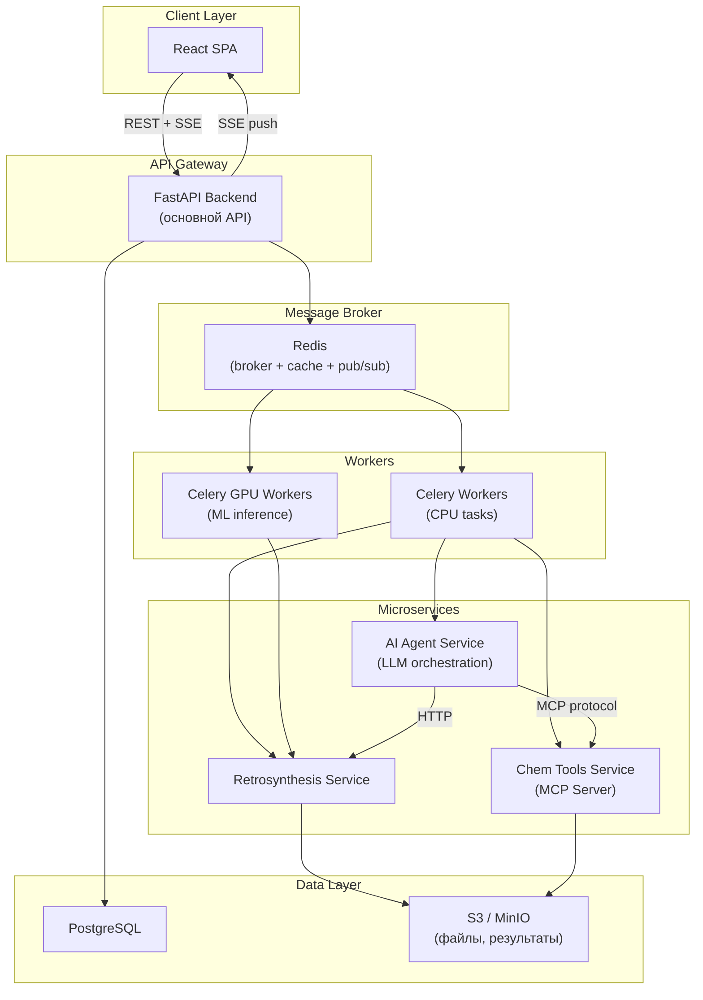

# Архитектурный план развития ChemCrow2

## 1. Анализ текущей структуры

Проект основан на [full-stack-fastapi-template](https://github.com/fastapi/full-stack-fastapi-template) и имеет классическую монорепо-структуру:

```
itmo_fatsapi/
├── backend/          # FastAPI + SQLModel + Alembic
│   ├── app/
│   │   ├── api/routes/   # 5 маршрутов (items, login, users, utils, private)
│   │   ├── core/         # config, db, security
│   │   ├── models.py     # User, Item (2 модели)
│   │   └── crud.py
│   └── Dockerfile
├── frontend/         # React 19 + TanStack Router + Vite + Ketcher
│   ├── src/
│   │   ├── routes/       # 8 страниц (dashboard, admin, items, settings, molecule-editor, login, signup, recover/reset)
│   │   ├── components/   # shadcn/ui, Sidebar, Admin, Items, MoleculeEditor
│   │   └── client/       # сгенерированный API-клиент (@hey-api/openapi-ts)
│   └── Dockerfile
├── compose.yml
├── compose.production.yml
└── scripts/
```

**Что есть**: JWT-аутентификация, CRUD User/Item, Ketcher (редактор молекул), Sentry, CI/CD (GitHub Actions), Docker Compose, Traefik-конфиги.

**Чего нет**: WebSocket/SSE, очередь задач, Redis, асинхронная обработка, чаты, интеграция с LLM.

---

## 2. Переезд в src/ -- НЕ нужен

Перенос в `src/` **не рекомендуется** по следующим причинам:

- Текущая структура `backend/` + `frontend/` на верхнем уровне -- стандарт для full-stack FastAPI-проектов
- Docker-контексты, compose-файлы, CI/CD -- всё завязано на текущие пути
- При добавлении микросервисов каждый из них будет отдельной директорией с собственным `Dockerfile` и `pyproject.toml`
- Переезд в `src/` сломает все Docker-конфиги, CI-пайплайны и скрипты без какого-либо выигрыша

**Вместо этого**: добавить директорию `services/` для новых микросервисов:

```
itmo_fatsapi/
├── backend/              # основной API-сервер (gateway)
├── frontend/             # React SPA
├── services/
│   ├── ai-agent/         # сервис AI-агентов
│   ├── retrosynthesis/   # ретросинтез
│   ├── chem-tools/       # химические инструменты (MCP)
│   └── worker/           # Celery-воркеры
├── shared/               # общий код (схемы, утилиты)
├── compose.yml
└── compose.production.yml
```

---

## 3. Целевая архитектура




---

## 4. Подробный план работ по фазам

### Фаза 1: Инфраструктурный фундамент (1-2 недели)

**4.1. Redis + Celery**

Добавить в [compose.yml](compose.yml):

```yaml
redis:
  image: redis:7-alpine
  restart: unless-stopped
  ports:
    - "6379:6379"
  volumes:
    - redis-data:/data
  healthcheck:
    test: ["CMD", "redis-cli", "ping"]
```

В [backend/pyproject.toml](backend/pyproject.toml) добавить зависимости: `celery[redis]`, `redis`.

Создать `backend/app/worker/`:

- `celery_app.py` -- конфигурация Celery
- `tasks/` -- директория задач

**4.2. Модели данных для чатов и задач**

Расширить [backend/app/models.py](backend/app/models.py):

```python
class Conversation(SQLModel, table=True):
    id: uuid.UUID = Field(default_factory=uuid.uuid4, primary_key=True)
    user_id: uuid.UUID = Field(foreign_key="user.id")
    title: str = Field(max_length=255)
    created_at: datetime = Field(default_factory=get_datetime_utc)
    messages: list["ChatMessage"] = Relationship(back_populates="conversation")

class ChatMessage(SQLModel, table=True):
    id: uuid.UUID = Field(default_factory=uuid.uuid4, primary_key=True)
    conversation_id: uuid.UUID = Field(foreign_key="conversation.id")
    role: str  # "user" | "assistant" | "system" | "tool"
    content: str
    tool_calls: str | None = None  # JSON
    created_at: datetime = Field(default_factory=get_datetime_utc)

class TaskJob(SQLModel, table=True):
    id: uuid.UUID = Field(default_factory=uuid.uuid4, primary_key=True)
    user_id: uuid.UUID = Field(foreign_key="user.id")
    task_type: str  # "retrosynthesis" | "property_prediction" | ...
    status: str = "pending"  # pending | running | completed | failed
    input_data: str  # JSON
    result_data: str | None = None  # JSON
    error: str | None = None
    celery_task_id: str | None = None
    created_at: datetime = Field(default_factory=get_datetime_utc)
    completed_at: datetime | None = None
```

**4.3. SSE (Server-Sent Events) для real-time обновлений**

SSE предпочтительнее WebSocket для данного кейса (однонаправленный поток от сервера, проще масштабировать, работает через HTTP/2). Добавить в backend:

```python
# backend/app/api/routes/events.py
from sse_starlette.sse import EventSourceResponse

@router.get("/events/tasks/{task_id}")
async def task_events(task_id: uuid.UUID, current_user: CurrentUser):
    async def event_generator():
        pubsub = redis.pubsub()
        await pubsub.subscribe(f"task:{task_id}")
        async for message in pubsub.listen():
            if message["type"] == "message":
                yield {"data": message["data"].decode()}
    return EventSourceResponse(event_generator())
```

Зависимость: `sse-starlette`.

---

### Фаза 2: AI-агент и чаты (2-3 недели)

**4.4. Сервис AI-агентов**

Структура `services/ai-agent/`:

```
services/ai-agent/
├── app/
│   ├── main.py          # FastAPI
│   ├── agent.py          # LangChain/LangGraph агент
│   ├── tools/            # инструменты агента
│   │   ├── retrosynthesis.py
│   │   ├── property_prediction.py
│   │   └── literature_search.py
│   ├── llm_providers/    # адаптеры для разных LLM API
│   │   ├── openai.py
│   │   ├── anthropic.py
│   │   └── base.py
│   └── config.py
├── Dockerfile
└── pyproject.toml
```

Ключевые решения:

- **LangGraph** для оркестрации агента (граф с инструментами, поддержка streaming)
- Агент вызывает инструменты через MCP-клиент или напрямую через HTTP
- Стриминг ответов через SSE: агент генерирует токены -> Redis pub/sub -> SSE endpoint в backend -> фронтенд

**4.5. Фронтенд: страница чатов**

Добавить в `frontend/src/routes/_layout/`:

- `chat.tsx` -- список чатов
- `chat/$conversationId.tsx` -- конкретный чат

Компоненты `frontend/src/components/Chat/`:

- `ChatList.tsx` -- список диалогов
- `ChatWindow.tsx` -- окно чата со стримингом
- `MessageBubble.tsx` -- сообщение (markdown, code blocks, молекулы)
- `ToolCallCard.tsx` -- карточка вызова инструмента (статус, результат)

Для SSE на фронтенде использовать `EventSource` или библиотеку `@microsoft/fetch-event-source` (поддержка POST + headers).

---

### Фаза 3: Микросервисы химических инструментов (2-4 недели)

**4.6. Сервис ретросинтеза**

```
services/retrosynthesis/
├── app/
│   ├── main.py           # FastAPI
│   ├── engines/
│   │   ├── aizynthfinder.py
│   │   └── base.py
│   ├── models.py         # Pydantic-схемы
│   └── config.py
├── Dockerfile            # с GPU-поддержкой (nvidia/cuda base)
└── pyproject.toml
```

- Принимает SMILES/MOL -> возвращает дерево ретросинтеза
- Запускается как Celery-задача (10с-2мин)
- Результаты сохраняются в S3/MinIO + PostgreSQL

**4.7. MCP-обёртка для химических инструментов**

```
services/chem-tools/
├── app/
│   ├── main.py           # MCP Server (mcp-python-sdk)
│   ├── tools/
│   │   ├── property_prediction.py
│   │   ├── similarity_search.py
│   │   ├── reaction_prediction.py
│   │   ├── docking.py
│   │   └── ...
│   └── config.py
├── Dockerfile
└── pyproject.toml
```

Использовать `mcp` Python SDK для создания MCP-сервера. Каждый инструмент -- отдельный `@mcp.tool()`:

```python
from mcp.server.fastmcp import FastMCP

mcp = FastMCP("ChemTools")

@mcp.tool()
async def predict_properties(smiles: str) -> dict:
    """Predict molecular properties from SMILES"""
    ...

@mcp.tool()
async def retrosynthesis(smiles: str, max_depth: int = 3) -> dict:
    """Run retrosynthetic analysis"""
    ...
```

AI-агент подключается к MCP-серверу как MCP-клиент и вызывает инструменты.

**4.8. Паттерн для долгих задач**

Для задач 10с-2мин использовать async polling + SSE:

1. Клиент отправляет POST `/api/v1/tasks/` -> получает `task_id`
2. Backend создаёт Celery-задачу
3. Клиент подписывается на SSE `/api/v1/events/tasks/{task_id}`
4. Celery-воркер выполняет задачу, публикует прогресс в Redis pub/sub
5. SSE-эндпоинт пробрасывает обновления клиенту
6. По завершении клиент получает `{ status: "completed", result_url: "..." }`

Альтернативно, клиент может поллить GET `/api/v1/tasks/{task_id}` каждые 2-5 секунд (проще, но менее эффективно).

---

### Фаза 4: Масштабирование и отказоустойчивость

**4.9. Compose для production с микросервисами**

Расширить [compose.production.yml](compose.production.yml):

```yaml
services:
  redis:
    image: redis:7-alpine
    restart: always
    volumes:
      - redis-data:/data

  celery-worker:
    build:
      context: .
      dockerfile: backend/Dockerfile
    command: celery -A app.worker.celery_app worker -l info -c 4
    depends_on: [redis, db]
    deploy:
      replicas: 2

  celery-beat:
    build:
      context: .
      dockerfile: backend/Dockerfile
    command: celery -A app.worker.celery_app beat -l info

  ai-agent:
    build:
      context: .
      dockerfile: services/ai-agent/Dockerfile
    depends_on: [redis]

  chem-tools:
    build:
      context: .
      dockerfile: services/chem-tools/Dockerfile

  retrosynthesis:
    build:
      context: .
      dockerfile: services/retrosynthesis/Dockerfile
    deploy:
      resources:
        reservations:
          devices:
            - driver: nvidia
              count: 1
              capabilities: [gpu]
```

---

## 5. Вычислительные ресурсы и защита от нагрузки

### Минимальные ресурсы (development / до 50 пользователей)

- **VPS/VDS**: 4 vCPU, 16 GB RAM, 100 GB SSD
- **PostgreSQL**: встроенный в compose (1 GB RAM)
- **Redis**: 512 MB RAM
- **Backend + Workers**: 2-4 GB RAM
- **GPU**: не обязательно (можно использовать внешние API для ML)
- **Ориентировочная стоимость**: 5000-10000 руб/мес (Selectel, Timeweb Cloud)

### Production (50-500 пользователей)

- **Backend**: 2 реплики, по 2 vCPU / 4 GB RAM каждая
- **Celery Workers**: 2-4 воркера, по 2 vCPU / 4 GB RAM
- **GPU Worker** (ретросинтез, ML): 1x NVIDIA T4 (16 GB VRAM) или A10G
- **PostgreSQL**: managed (Yandex Cloud, Selectel) -- 2 vCPU / 8 GB RAM
- **Redis**: 2 GB RAM (managed или свой)
- **S3**: для хранения результатов
- **Ориентировочная стоимость**: 30000-60000 руб/мес (без GPU), +20000-40000 руб/мес за GPU

### Защита от наплыва пользователей

- **Rate limiting**: `slowapi` или `fastapi-limiter` на уровне API (например, 10 задач/мин на пользователя)
- **Celery concurrency**: ограничение числа одновременных задач (`-c 4` на воркер)
- **Task priority**: разные очереди Celery для разных типов задач (быстрые vs GPU-тяжёлые)
- **Connection pooling**: SQLAlchemy pool для PostgreSQL, ограничение `max_connections`
- **Nginx rate limiting**: в [frontend/nginx.conf](frontend/nginx.conf) добавить `limit_req_zone`
- **Horizontal scaling**: `deploy.replicas` в compose + load balancer (Traefik уже есть в конфигурации)
- **Circuit breaker**: для внешних API (OpenAI, Anthropic) -- `tenacity` с exponential backoff
- **Кэширование**: Redis-кэш для повторных запросов (одинаковые молекулы, свойства)
- **Таймауты**: hard timeout на Celery-задачи (`task_time_limit=300`)

---

## 6. Как правильно добавлять новые микросервисы

Стандартный чеклист для нового микросервиса:

1. Создать директорию `services/<name>/` с `app/main.py`, `Dockerfile`, `pyproject.toml`
2. Добавить сервис в `compose.yml` и `compose.production.yml`
3. Если нужен API -- добавить роут-прокси или прямой вызов из backend
4. Если долгая задача -- реализовать как Celery task с SSE-нотификациями
5. Если MCP-инструмент -- использовать `mcp` SDK, регистрировать `@mcp.tool()`
6. Добавить health-check endpoint
7. Добавить CI-тесты в `.github/workflows/`
8. Обновить `scripts/generate-client.sh` если сервис меняет OpenAPI-схему backend

